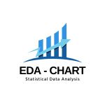

# Project1-EDA
> **Brief Description:** A concise introduction to what your project is about and its main purpose.

---

## Table of Contents

- [Description](#description)
- [Technologies Used](#technologies-used)
- [Data File](#data-file)
- [Program Codes ](#program-codes)
- [Screenshots](#screenshots)
- [Contributing](#contributing)
- [Contact Information](#contact-information)

---

## Description

Provide a detailed description of your project. Explain its significance, objectives, and who it might benefit. You can also discuss the context or problem it addresses.

Example:

## Technologies-used

Python programming language

## Data-file

about data file

## Program-codes

about program code

## Screenshots
